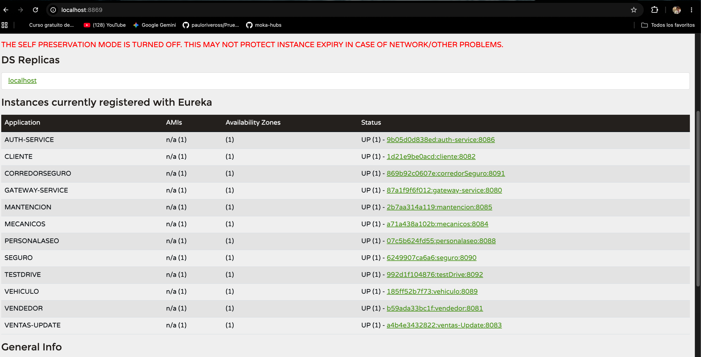

<div align="center">

# 🚘 Automotora Run!

**Plataforma de microservicios para gestión automotriz**


</div>

---

## 📖 Sobre el Proyecto

Sistema backend para Automotoras que busquen modernizar sus sistemas, construido con **13 microservicios** en **Spring Boot 4.0.6** y **Spring Cloud 2025.0.1**. Utiliza **Eureka** para descubrimiento de servicios, **Spring Cloud Gateway** como API Gateway, **JWT** para autenticación, y base de datos **MySQL** en la nube vía **Aiven** (cada microservicio con su propia BD independiente).

Proyecto evaluativo número 3 para la asignatura de **FullStack 1** — Duoc UC.

---

## 📦 Microservicios

| # | Servicio | Puerto | BD | Descripción |
|---|----------|--------|----|-------------|
| 1 | **eureka-server** | `8869` | — | Service Registry (Netflix Eureka) |
| 2 | **gateway-service** | `8080` | — | API Gateway (Spring Cloud Gateway) |
| 3 | **auth-service** | `8086` | `auth-service` | Autenticación y JWT |
| 4 | **cliente** | `8082` | `clientes` | CRUD clientes (Flyway + DataFaker) |
| 5 | **vehiculo** | `8089` | `vehiculo` | CRUD vehículos |
| 6 | **vendedor** | `8081` | `vendedor` | CRUD vendedores |
| 7 | **mecanicos** | `8084` | `mecanicos` | CRUD mecánicos |
| 8 | **ventas-Update** | `8083` | `ventas` | Gestión de ventas |
| 9 | **mantenciones** | `8085` | `mantenciones` | Gestión de mantenciones |
| 10 | **testDrive** | `8092` | `testdrives` | Gestión de test drives |
| 11 | **seguro** | `8090` | `seguros` | Seguros vehiculares |
| 12 | **corredorSeguro** | `8091` | `corredorseguros` | Corredores de seguros |
| 13 | **personalaseo** | `8088` | `personalaseo` | Personal de limpieza |

---

## 🧪 Pruebas con Postman

En la raíz del proyecto hay dos colecciones Postman en formato JSON listas para importar y probar todos los endpoints:

| Archivo | Propósito |
|---|---|
| `PruebaLocalDocker.postman_collection.json` | Pruebas del ecosistema completo **en local con Docker** |
| `PruebasRenderConRutaGateway.postman_collection.json` | Pruebas contra los servicios **desplegados en Render** vía Gateway |

**Importar en Postman:** `File > Import` → seleccionar el archivo `.json` → las requests aparecerán organizadas con autenticación JWT incluida.

---

## 🛠️ Requisitos

- **Java 21**
- **Maven 3.9+**
- **Laragon** (opcional, para scripts SQL MySQL)
- **Docker**
- **Postman** (opcional)

---

## 🚀 Ejecución Local

### 1. Clonar e iniciar Eureka
**Los servicios se pueden iniciar de manera manual en el IDE o en terminal**

```bash
git clone <repo-url>
cd Prueba2FullStack1

mvn -pl eureka-server spring-boot:run
```

### 2. Iniciar Gateway

```bash
mvn -pl gateway-service spring-boot:run
```

### 3. Iniciar Auth

```bash
mvn -pl auth-service spring-boot:run
```

### 4. Iniciar servicios

```bash
mvn -pl cliente spring-boot:run
mvn -pl vehiculo spring-boot:run
mvn -pl vendedor spring-boot:run
mvn -pl mecanicos spring-boot:run
mvn -pl mantenciones spring-boot:run
mvn -pl ventas-Update spring-boot:run
mvn -pl seguro spring-boot:run
mvn -pl corredorSeguro spring-boot:run
mvn -pl testDrive spring-boot:run
mvn -pl personalaseo spring-boot:run
```

> **Tip:** Compila todo primero con `mvn clean package -DskipTests` y ejecuta los JARs.

### 5. Acceder

```
Gateway:      http://localhost:8080
Eureka:       http://localhost:8869
Swagger:      http://localhost:<puerto>/swagger-ui.html
```

---

## 🐳  Contenedores De Docker

```bash
Para levantar el ecosistema completo en tu máquina local y probar la integración con las bases de datos en la nube, asegúrate de tener Docker activo y ejecuta en la raíz del proyecto:
docker-compose up --build

```

---

## ☁️ Render

```bash
# Build y deploy automático vía render.yaml
# 12 servicios en plan gratuito
# Dockerfiles en render/docker/
```

### URLs de Servicios Desplegados

| Servicio | URL |
|----------|-----|
| **Gateway Service** | https://automotora-gateway-service.onrender.com |
| **Auth Service** | https://automotora-auth-service.onrender.com |
| **Cliente** | https://automotora-cliente.onrender.com |
| **Vendedor** | https://automotora-vendedor.onrender.com |
| **Vehículo** | https://automotora-vehiculo.onrender.com |
| **Ventas** | https://automotora-ventas-update.onrender.com |
| **Mantenciones** | https://automotora-mantenciones.onrender.com |
| **Mecánicos** | https://automotora-mecanicos.onrender.com |
| **Seguro** | https://automotora-seguro.onrender.com |
| **CorredorSeguro** | https://automotora-corredorseguro.onrender.com |
| **Test Drive** | https://automotora-testdrive.onrender.com |
| **Personal Aseo** | https://automotora-personal-aseo.onrender.com |

---

## 🔐 Autenticación

**Login:**

```bash
POST http://localhost:8080/auth/login
Content-Type: application/json

{ "username": "admin", "password": "admin1234" }
```

Respuesta:

```json
{ "token": "eyJ...", "username": "admin", "rol": "Admin" }
```

**Endpoints protegidos:** Ventas, Mantenciones, Seguros y TestDrive requieren `Authorization: Bearer <token>`.

**Usuario por defecto (cargado automáticamente):**

| Username | Password | Rol |
|---|---|---|
| `admin` | `admin1234` | Admin |

---

## 🔀 Gateway

Todas las rutas pasan por `http://localhost:8080`:

| Ruta | Destino |
|---|---|
| `/auth/**` | Auth Service |
| `/api/v1/clientes/**` | Cliente |
| `/api/v1/vehiculos/**` | Vehículo |
| `/api/v1/vendedores/**` | Vendedor |
| `/api/v1/mecanicos/**` | Mecánicos |
| `/api/v1/ventas/**` | Ventas |
| `/api/v1/mantenciones/**` | Mantenciones |
| `/api/v1/seguros/**` | Seguros |
| `/api/v1/corredores/**` | Corredores |
| `/api/v1/testdrives/**` | Test Drive |
| `/api/v1/personalaseo/**` | Personal Aseo |

---

## 📁 Estructura

```
Prueba2FullStack1/
├── auth-service/           # JWT auth
├── cliente/                # CRUD + Flyway + DataFaker
├── corredorSeguro/         # CRUD corredores
├── eureka-server/          # Service registry
├── gateway-service/        # API Gateway
├── mantenciones/           # Gestión mantenciones
├── mecanicos/              # CRUD mecánicos
├── personalaseo/           # CRUD personal aseo
├── seguro/                 # Gestión seguros
├── testDrive/              # Gestión test drives
├── vehiculo/               # CRUD vehículos
├── vendedor/               # CRUD vendedores
├── ventas-Update/          # Gestión ventas
├── ScriptsSql/             # Scripts SQL (MySQL)
├── render/docker/          # Dockerfiles para Render
├── docker-compose.yml
├── docker-compose.render-local.yml
├── pom.xml
├── render.yaml
└── README.md
```

---

## 👥 Equipo

| Integrantes |
|---|
| Emanuel Barra |
| Joaquin Fuenzalida |
| Paulo Riveros |
| Benjamin Vargas |

---

## 🎥 Evidencia de Pruebas

### Local



**Ejecución de Docker** — *haz clic en la imagen para ver el video*

<p align="center">
  <a href="https://youtu.be/xwyWpW9PQ7g"></a>
</p>

**Pruebas Postman Docker Local** — *haz clic en la imagen para ver el video*

<p align="center">
  <a href="https://youtu.be/NP3r050X_XQ"></a>
</p>

### Remoto

**DBeaver — Muestra de Datos, Eliminar y Actualizar Venta** — *haz clic en la imagen para ver el video*

<p align="center">
  <a href="https://youtu.be/ULZQnanBPeo"></a>
</p>

**Pruebas Render en Postman con URL de Gateway** — *haz clic en la imagen para ver el video*

<p align="center">
  <a href="https://youtu.be/ebAsaBwxM-c"></a>
</p>

**Render Aiven Dashboard** — *haz clic en la imagen para ver el video*

<p align="center">
  <a href="https://youtu.be/Phzl1fQQ60M"></a>
</p>

---

<div align="center">

**Duoc UC — FullStack 1 — 2026**

</div>
